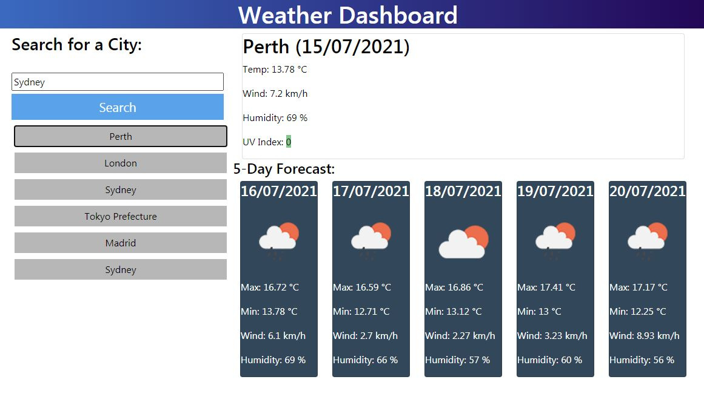

# SLV_WeatherDash
# Boot Camp Spot Assignment 6 - Weather Dashboard

I have created a JavaScript app using Web APIs, Third Party APIs and Server-Side APIs to create a Weather Dashboard. It can display the weather for cities around the world and uses the Open Weather Map API.

Click [here](https://scottyv6.github.io/SLV_WeatherDash/) to see the website hosted on GitHub

Image below

